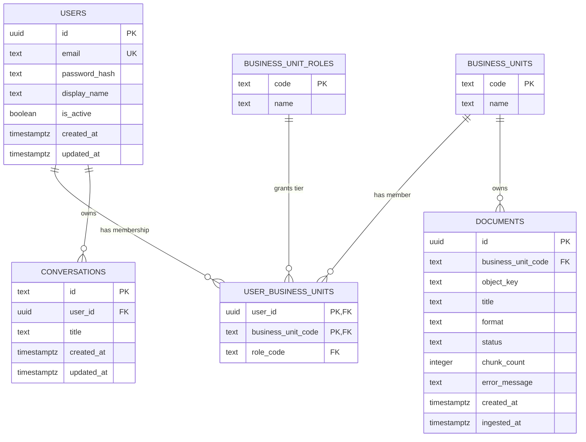
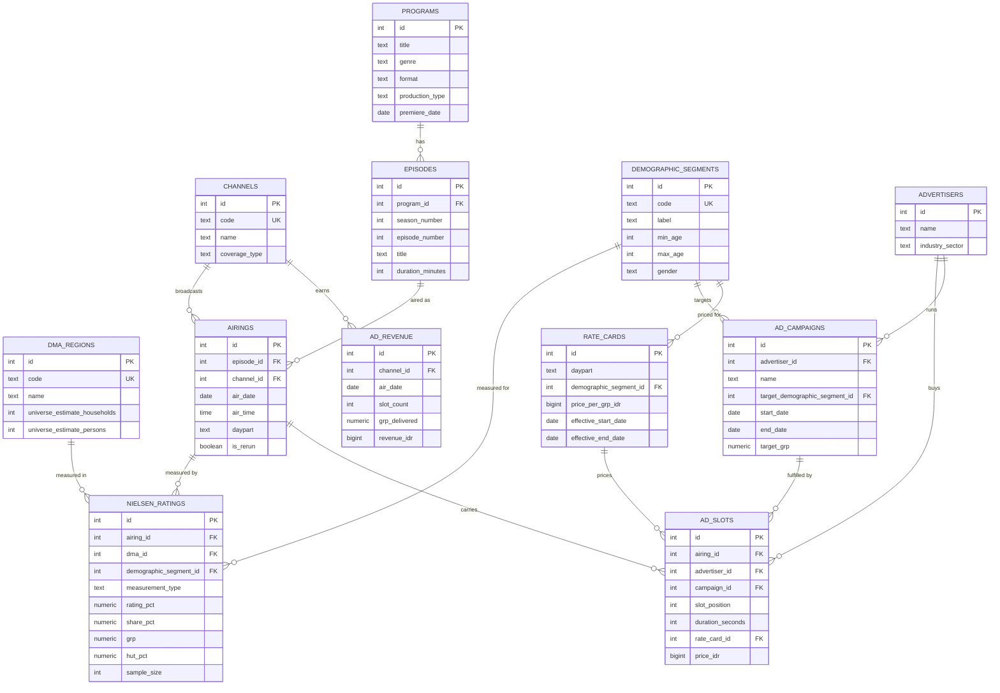
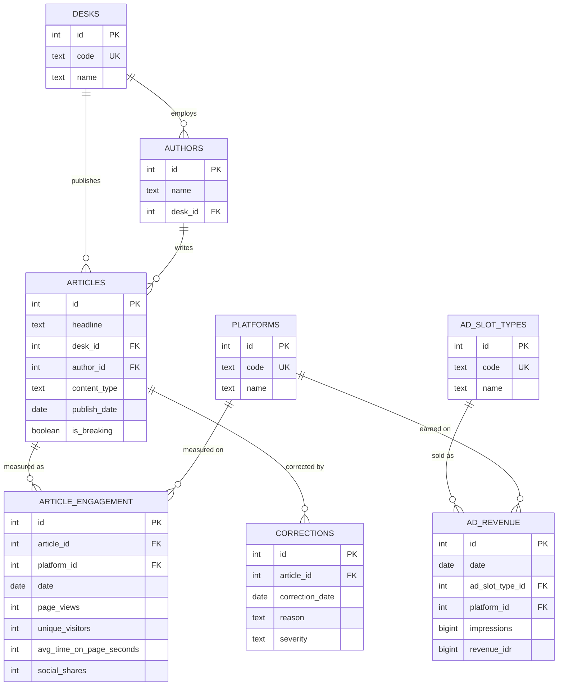

# Entity Relationship Diagrams

Nova follows a **Data Mesh** architecture (ADR-0005): there is no single
consolidated database. Each business unit owns its own PostgreSQL instance,
plus one shared `nova_core` instance for identity, access, and conversation
state (ADR-0021, ADR-0022). Because these databases never share foreign
keys across instances, they are documented as four separate ERDs rather
than one combined diagram.

| Database | Owner | Purpose |
|---|---|---|
| `nova_core` | `backend/` | Identity & access, conversations, document ingestion metadata |
| `mcn_tv` | `mcp_servers/tv/` | MCN TV analytics — Nielsen-style dimensional model (ADR-0023) |
| `mcn_plus` | `mcp_servers/plus/` | MCN+ analytics — streaming + shorts dimensional model (ADR-0023) |
| `mcn_news` | `mcp_servers/news/` | MCN News analytics — dimensional model (ADR-0023) |

Each business unit's analytics schema is a **dimensional (star) model**
(dimension + fact tables), not the flat 3-table schema of earlier phases —
see [ADR-0023](adr/0023-analytics-dimensional-data-model.md) for why, and
each unit's `semantic/schema.yaml` (ADR-0024) for the full business-meaning
writeup behind every table/column shown below.

## 1. `nova_core` — Identity, Access & Conversation State



Notes:
- `USER_BUSINESS_UNITS` is the single membership+role claim table: one row
  per (user, business unit), carrying that unit's permission tier
  (`employee` / `finance` / `admin`).
- `BUSINESS_UNITS` includes a virtual `"group"` entry for MCN Group
  corporate-level claims (e.g. `group_admin`), not a real per-unit MCP
  server.
- `CONVERSATIONS` is sidebar metadata only (title, owner, recency) — actual
  message content and agent state live in LangGraph's own checkpoint
  tables, which are intentionally not modeled here (owned by the
  checkpointer, not Alembic).
- `DOCUMENTS` tracks knowledge-base source files through the ingestion
  pipeline (MinIO → Celery → Qdrant); `(business_unit_code, object_key)` is
  unique.

## 2. `mcn_tv` — MCN TV Analytics (Nielsen-style dimensional model)



Follows the real-world Nielsen audience-measurement model: every rating is
scoped to a DMA (market) and a demographic segment, and ad pricing
(`rate_cards`/`ad_slots`) is negotiated in GRP, not raw viewer counts. See
`mcp_servers/tv/semantic/schema.yaml`'s glossary for DMA/Rating/Share/
GRP/HUT definitions. `daypart` is constrained to
`prime_time | day_time | late_night` throughout.

## 3. `mcn_plus` — MCN+ Analytics (Streaming + Shorts)

```mermaid
erDiagram
    REGIONS {
        int id PK
        text name UK
    }

    DEVICES {
        int id PK
        text device_type
        text platform
    }

    LICENSORS {
        int id PK
        text name
        text country
    }

    SUBSCRIPTION_PLANS {
        int id PK
        text code UK
        text name
        bigint price_idr
        int max_concurrent_streams
    }

    COIN_PACKAGES {
        int id PK
        text code UK
        int coin_amount
        bigint price_idr
    }

    TITLES {
        int id PK
        text title
        text product
        text content_type
        text genre
        text maturity_rating
        int licensor_id FK
        date release_date
    }

    SEASONS {
        int id PK
        int title_id FK
        int season_number
    }

    EPISODES {
        int id PK
        int title_id FK
        int season_id FK
        int episode_number
        int duration_seconds
        date release_date
    }

    SUBSCRIBERS {
        int id PK
        text external_subscriber_code UK
        date signup_date
        int region_id FK
        int primary_device_id FK
    }

    ENGAGEMENT {
        int id PK
        int title_id FK
        int episode_id FK
        date date
        text product
        int device_id FK
        int region_id FK
        int watch_minutes
        numeric completion_rate
        int viewers
    }

    SUBSCRIPTIONS {
        int id PK
        int subscriber_id FK
        int plan_id FK
        date start_date
        date end_date
        text status
        text churn_reason
    }

    SUBSCRIPTION_TRANSACTIONS {
        int id PK
        int subscriber_id FK
        int plan_id FK
        date billing_date
        bigint amount_idr
        text status
    }

    COIN_TRANSACTIONS {
        int id PK
        int subscriber_id FK
        int coin_package_id FK
        int title_id FK
        date transaction_date
        int coins_spent
        bigint amount_idr
    }

    CONTENT_LICENSING_COSTS {
        int id PK
        int title_id FK
        int licensor_id FK
        bigint license_fee_idr
        date license_start_date
        date license_end_date
    }

    REVENUE {
        int id PK
        date date
        text product
        bigint subscription_revenue_idr
        bigint coin_revenue_idr
        int active_subscribers
    }

    TITLES ||--o{ SEASONS : "has"
    TITLES ||--o{ EPISODES : "has"
    SEASONS ||--o{ EPISODES : "groups"
    LICENSORS ||--o{ TITLES : "licenses"
    LICENSORS ||--o{ CONTENT_LICENSING_COSTS : "charges"
    TITLES ||--o{ CONTENT_LICENSING_COSTS : "costs"
    TITLES ||--o{ ENGAGEMENT : "watched as"
    EPISODES ||--o{ ENGAGEMENT : "watched as"
    DEVICES ||--o{ ENGAGEMENT : "measured on"
    REGIONS ||--o{ ENGAGEMENT : "measured in"
    REGIONS ||--o{ SUBSCRIBERS : "located in"
    DEVICES ||--o{ SUBSCRIBERS : "primary device"
    SUBSCRIBERS ||--o{ SUBSCRIPTIONS : "has"
    SUBSCRIPTION_PLANS ||--o{ SUBSCRIPTIONS : "tier"
    SUBSCRIBERS ||--o{ SUBSCRIPTION_TRANSACTIONS : "billed"
    SUBSCRIPTION_PLANS ||--o{ SUBSCRIPTION_TRANSACTIONS : "billed for"
    SUBSCRIBERS ||--o{ COIN_TRANSACTIONS : "purchases"
    COIN_PACKAGES ||--o{ COIN_TRANSACTIONS : "purchased as"
    TITLES ||--o{ COIN_TRANSACTIONS : "unlocks"
```

Per ADR-0014, MCN+ and MCN+ Shorts are one business unit with two
products, not two separate schemas — `product` (`streaming | shorts`) is a
column on `titles`/`engagement`/`revenue`, shared structures used by both.
Monetization is deliberately split into two fact tables —
`subscription_transactions` (streaming, plan-based) and
`coin_transactions` (shorts, one-off coin unlocks) — since they're
genuinely different business models. `REVENUE` is a daily rollup, not
per-title, so it has no FK to `TITLES`.

## 4. `mcn_news` — MCN News Analytics



`AD_REVENUE` here is not per-article (ad inventory is sold platform-wide,
by slot type and platform, not per-story), so it has no FK to `ARTICLES` —
unlike `mcn_tv`'s airing-linked ad slots. `CORRECTIONS` reflects the
correction/retraction SOP already in the knowledge base
(`severity`: `minor | major | retraction`).

## Cross-database relationships (logical, not enforced)

Each business unit's analytics database is referenced logically by
`nova_core.business_units.code` (`tv` / `plus` / `news`) and
`nova_core.documents.business_unit_code` — there is no physical foreign
key across database instances, by design (ADR-0005: each unit's data is
queried live via that unit's own MCP server, never joined at the database
level).
