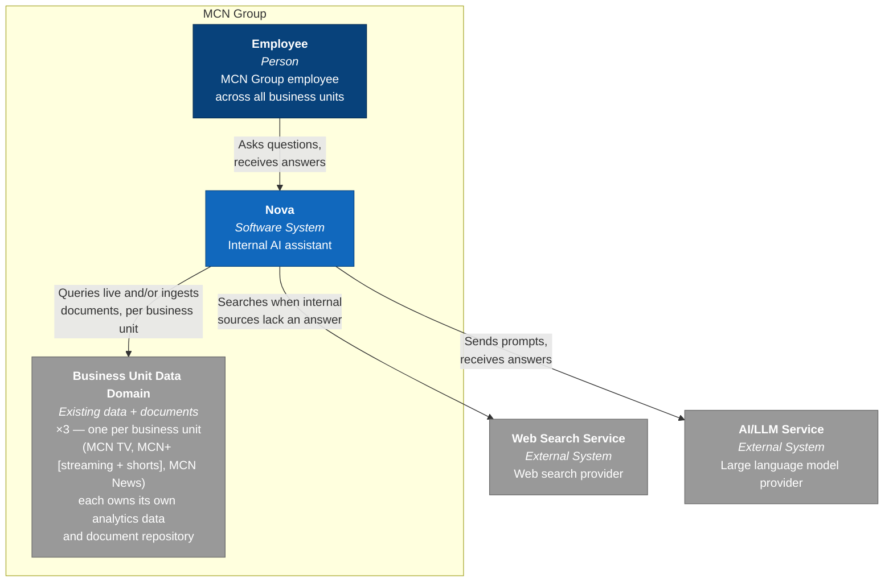
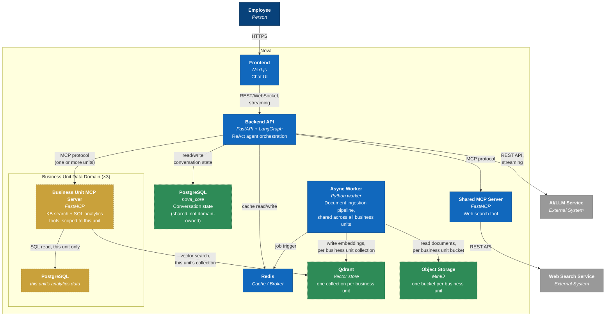
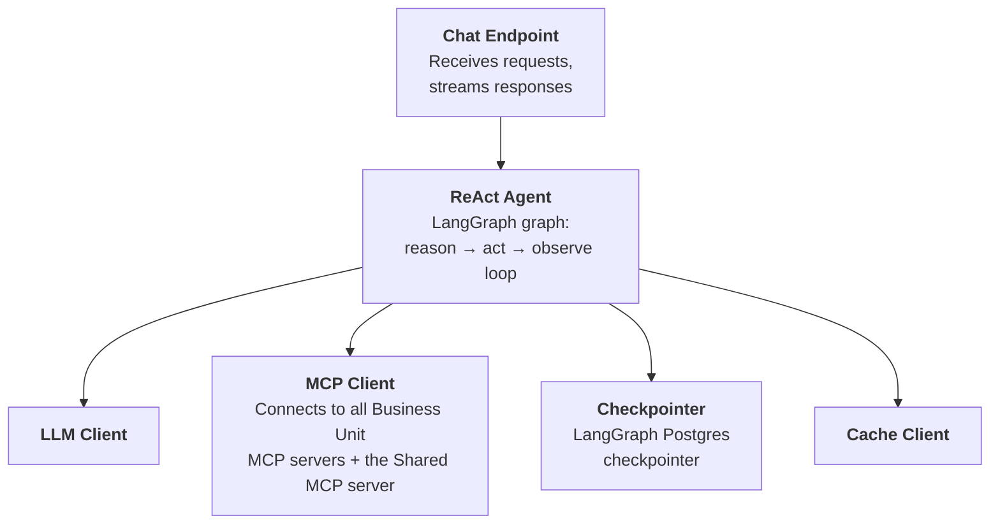
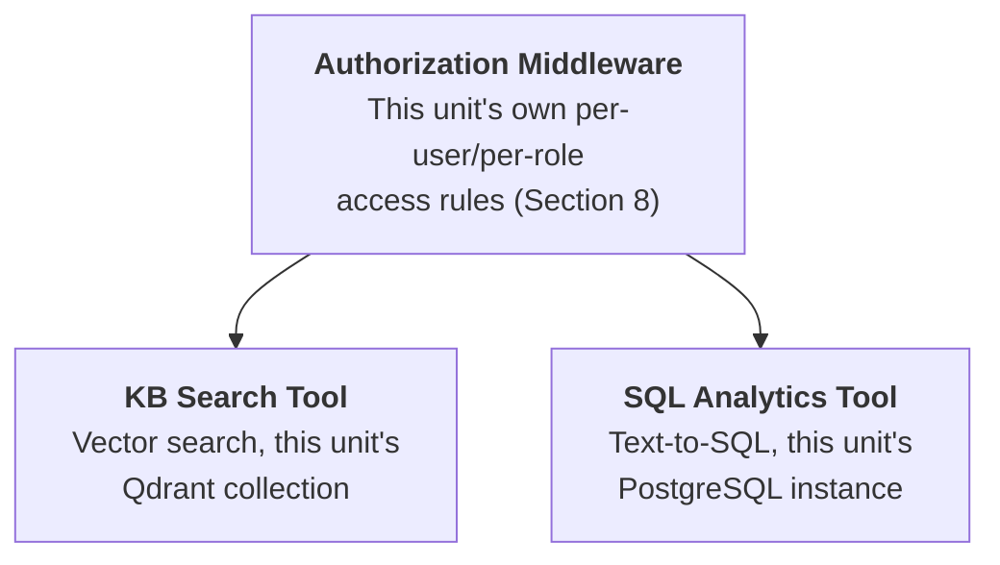
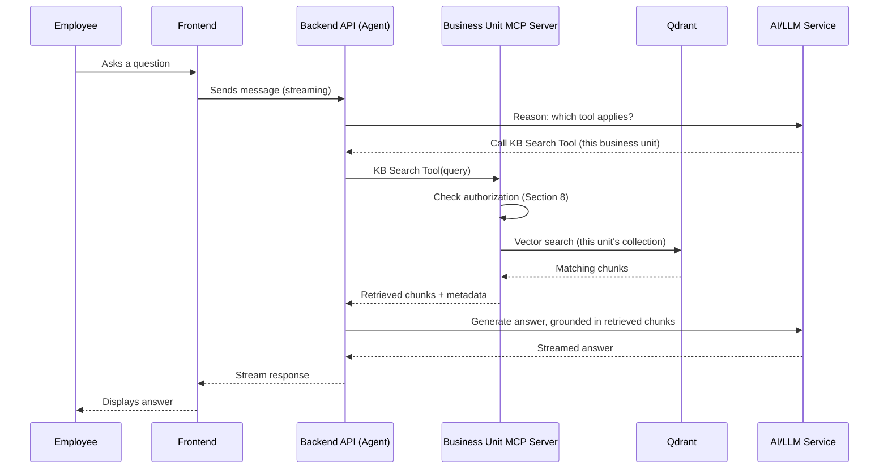
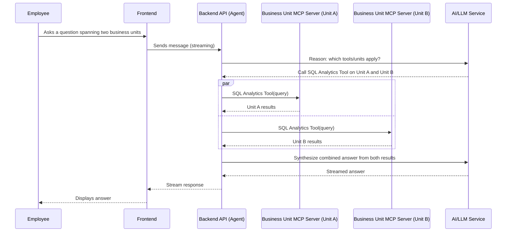
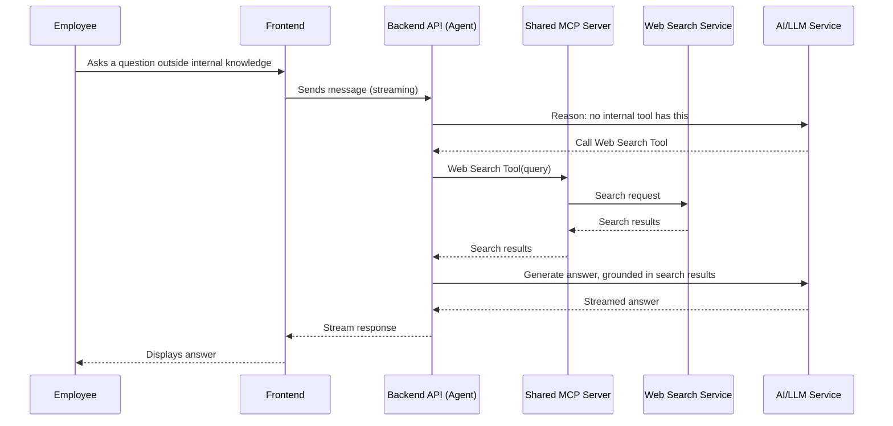
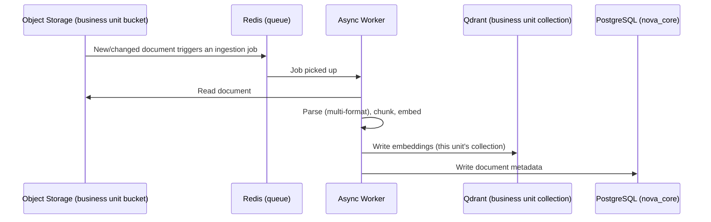
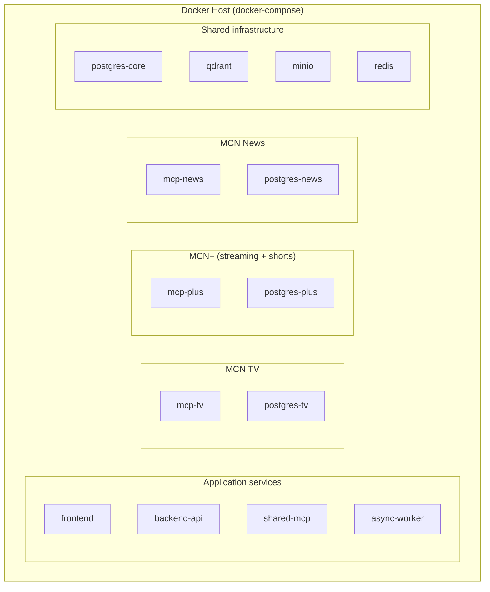

# Nova — Technical Design Document

Architecture and design documentation for Nova, MCN Group's internal AI
assistant. Structured using [arc42](https://arc42.org), with
[C4 Model](https://c4model.com) diagrams and
[ADRs](https://adr.github.io/) for architecture decisions.

Each of these three frameworks was picked to solve a different documentation
failure mode. arc42 is a fixed but lightweight checklist of architectural
concerns — it makes sure nothing important (requirements, context,
decisions, runtime behavior, deployment, risk) gets forgotten, without
forcing every section to be exhaustive. C4 addresses a different problem:
architecture diagrams usually fail because they mix zoom levels into one
unreadable picture, so C4 fixes a small set of zoom levels (Context →
Container → Component → Code), each answering one question at one altitude.
ADRs address a third problem — the *reasoning* behind a decision goes stale
faster than the code itself, so each significant decision is captured once,
at the moment it's made, as a standalone record that's never silently
edited (only superseded). See [reference/](reference/) for the full notes
on each framework.

Status: **Complete draft — all 12 arc42 sections filled.** Ready for
review. Remaining follow-up work (Section 11) is implementation-level, not
open design questions.

---

## 1. Introduction and Goals

### 1.1 Requirements Overview

Nova is an internal AI assistant for MCN Group that helps employees get
answers quickly by combining three sources of knowledge: the company's
internal documentation, structured company data, and the public web.

**Functional goals:**

1. As an employee, I want to ask questions about company SOPs/documentation
   in natural language, so that I don't have to manually search through
   documents.
2. As an employee, I want to ask questions about company data (viewership,
   subscribers, engagement, etc.), so that I can get quick insights without
   writing SQL myself.
3. As an employee, I want the assistant to search the web when the answer
   isn't in internal knowledge, so that I still get an answer instead of a
   dead end.
4. As an employee, I want a single chat interface for all of the above, so
   that I don't need to switch between different tools depending on the
   question type.

**Non-goals:**

- Not a replacement for BI dashboards — Nova surfaces answers
  conversationally, it does not aim to replace dedicated analytics tooling.
- Not a document editor — Nova reads/retrieves from the knowledge base, it
  does not manage document authoring/versioning.
- No multi-tenant / external-facing use — Nova is for internal MCN Group
  employees only.

### 1.2 Quality Goals

Quality goals are defined using [ISO/IEC 25010](reference/iso-25010.md)
rather than freeform adjectives. "Good quality" means different things to
different people, and without a shared vocabulary, quality goals collapse
into vague terms ("robust", "scalable") nobody can prioritize against each
other. ISO 25010 fixes this with a named set of 9 quality characteristics,
so trade-offs (e.g. optimizing Reliability over Flexibility) can be made
explicit instead of accidental.

All 9 characteristics are assessed below for relevance to Nova and ranked
accordingly. The **top 5** are set as this project's quality goals (arc42
recommends limiting to 3-5 so the goals stay actionable and drive real
trade-offs, rather than trying to satisfy all 9 equally).

| Rank | ISO 25010 Characteristic | Relevance | Set as Goal? | Motivation |
|---|---|---|---|---|
| 1 | Functional Suitability (Groundedness / Accuracy) | High | ✅ | Answers must be based on real sources (KB/data/web), not hallucinated — critical for trust, especially when used for decision-making from company data. |
| 2 | Performance Efficiency (Response Latency) | High | ✅ | Queries pass through multiple stages (retrieval, LLM, SQL/web search) — must still feel responsive, especially with streaming. |
| 3 | Reliability | High | ✅ | Depends on multiple external dependencies (LLM provider, web search API, DB) — must degrade gracefully rather than fail completely. |
| 4 | Security | High | ✅ | Internal data (SOPs, company analytics) is sensitive — must have access boundaries and not leak via web search or other exposure. |
| 5 | Maintainability | Medium | ✅ | 4 business units with continuously growing data — new KB documents and data sources must be addable without major redesign. |
| 6 | Usability | Medium | ❌ | Chat interfaces are now a familiar UX pattern (ChatGPT, Claude, etc.) — low design risk, doesn't need to be a driving goal. |
| 7 | Flexibility *(portability/scalability)* | Low–Medium | ❌ | No large-scale usage requirement in current scope; containerization already gives reasonable headroom without making it a dedicated goal. |
| 8 | Compatibility | Low | ❌ | No requirement yet to interoperate with other internal systems (e.g. Slack/Teams); single standalone chat interface for now. |
| 9 | Safety | Not applicable | ❌ | Concerns physical/safety-critical harm (e.g. medical, automotive) — not relevant to an internal chatbot. |

### 1.3 Stakeholders

Stakeholders are identified using the
[Rozanski & Woods stakeholder framework](reference/rozanski-woods-stakeholders.md)
rather than an open brainstorm. Architects instinctively think about
"users," but a system is shaped by far more people than whoever uses it
directly — the people who fund it, own the data it draws from, and are
legally accountable for it all have architectural concerns too. The
framework provides a fixed set of 11 stakeholder roles so none of them get
forgotten by default. For this project, several of the 11 roles collapse
onto the
same small team and were consolidated; one role (Data/Content Owners) was
added outside the original 11 because it's specifically relevant to a
RAG-based system. The full role-by-role mapping is in the reference notes
linked above — the table below is the applied result.

| Stakeholder | Description | Expectations |
|---|---|---|
| **Users** | Employees across MCN TV, MCN+ (streaming & shorts), MCN News, and Group Functions | Fast, accurate answers without needing to search manually or write SQL themselves |
| **Data/Content Owners** | Business units that own the SOPs, documents, and data Nova retrieves from | Their content is represented accurately; sensitive data isn't exposed beyond its intended audience |
| **Platform/Engineering Team** | Builds, deploys, maintains, tests, and supports Nova (consolidates Developers, Maintainers, Production Engineers, Support Staff, System Administrators, Testers, and Communicators) | System stays maintainable and extensible as KB documents and data sources grow; observable enough to debug issues quickly |
| **External Providers** *(LLM provider, web search API, hosting/cloud infrastructure)* | External parties Nova depends on to function | *Not an expectation on the architecture — the reverse: the architecture must account for their limitations (rate limits, downtime, latency) as an external dependency.* |
| **Legal & Compliance** | Oversees data governance and regulatory conformance | Internal/sensitive data must not leak externally (e.g. via web search calls); access is auditable |
| **Group Management / Leadership** | Sponsors and funds Nova | Clear return on investment, high adoption, and no added security/legal risk from the investment |

---

## 2. Architecture Constraints

Constraints are requirements that limit the architect's freedom of design or
implementation choice — arc42 groups these into four categories: Technical,
Organizational, Political, and Conventions.

| Category | Constraint | Rationale |
|---|---|---|
| Technical | Backend must be implemented in Go, Python, or Rust | MCN Group's engineering standard for backend services |
| Technical | Frontend must be implemented in React or Next.js | MCN Group's engineering standard for internal web tooling |
| Technical | All components must be containerized (Docker) | Aligns Nova's deployment with MCN Group's existing operational practices |
| Organizational | Nova is built and maintained by a single, small Platform/Engineering team | Limits how much operational complexity the architecture can introduce without becoming a maintenance burden |
| Organizational | Prefer open-source/self-hosted tooling over costly managed services where reasonable | Nova is an internal tool, not a revenue-generating product — no large dedicated budget |

No Political constraints or additional Conventions have been identified at
this stage; this table will be revisited if any emerge.

## 3. System Scope and Context

### 3.1 Business Context

Nova's external communication partners, from a business/domain perspective
(who Nova talks to, and why — no protocol detail yet, see 3.2 for that).

**Guiding principle: Data Mesh.** Rather than treating MCN Group's data as
one centralized warehouse, Nova follows
[Data Mesh](https://martinfowler.com/articles/data-monolith-to-mesh.html)
thinking: each business unit (MCN TV, MCN+, MCN News) owns and
serves its own data as a product, rather than a central data team owning
everything. MCN+ itself spans two products (OTT streaming and Shorts
micro-drama) but is one business unit/data domain, not two (ADR-0014).
Concretely, each business unit has its **own analytics data
source and its own document repository** — there is no pre-consolidated,
single warehouse. When a question needs data from more than one business
unit, that federation happens at query time, in Nova's agent (Section 5),
not upfront via ETL. This was a deliberate late change from an earlier
single-warehouse design (see the ADR in Section 9 for the full trade-off
discussion) — it trades some complexity (more data sources, cross-domain
queries need to be federated by the agent) for tighter alignment with how
a large, multi-business-unit company like MCN Group actually assigns data
ownership, and for better failure isolation between business units
(Reliability, Section 1.2).

Visualized as a [C4](reference/c4-model.md) System Context diagram — the
"Business Unit Data Domain" box repeats once per business unit (×3):

| Partner | Role |
|---|---|
| **Employee** | Primary user — asks questions via the chat interface, receives answers |
| **Business Unit Data Domain** *(×3 — MCN TV, MCN+ [streaming + shorts], MCN News)* | Each business unit's existing analytics data and document repository, owned and governed by that unit; Nova queries analytics live and ingests documents per business unit — no shared central warehouse |
| **Web Search Service** *(external)* | Supplies external knowledge when internal sources (KB, data) don't have the answer — an explicit functional requirement, not an optional add-on |
| **AI/LLM Service** *(external)* | Understands questions and generates Nova's answers |

### 3.2 Technical Context

Same partners as 3.1, restated with the interface/protocol used to
communicate with each:

| Partner | Interface | Protocol / Format |
|---|---|---|
| Employee ↔ Nova | Web browser | HTTPS; chat over REST, with streaming for responses |
| Nova → each Business Unit's analytics data | Direct database connection, via that business unit's MCP server | PostgreSQL wire protocol, read-oriented queries |
| Nova → each Business Unit's document repository | Object storage, via that business unit's MCP server / the ingestion pipeline | To be defined further in Section 5/8 |
| Nova → Web Search Service | REST API | HTTPS/JSON |
| Nova → AI/LLM Service | REST API | HTTPS/JSON, streaming |

**Note on data freshness:** analytics data and documents need different
strategies to stay aligned with Nova. Structured data (PostgreSQL) is
queried live at question-time, so there's no separate copy to go stale.
Unstructured documents must be embedded into a vector store for retrieval,
so Nova needs an ingestion/sync pipeline that detects changes
(new/edited/deleted documents) and re-embeds — this responsibility is
assigned to the async worker in Section 5. Both apply per business unit,
consistent with the Data Mesh framing above.

## 4. Solution Strategy

arc42 treats this section as a bridge between the goals (Section 1) and the
detailed views that follow (Sections 5-9) — a high-level summary of the
fundamental approach, not the full detail.

**Architectural pattern: agentic tool-calling over a data mesh.** Nova is
built around a single Backend API that orchestrates an LLM which decides,
per question, which tool(s) to invoke: knowledge base retrieval (RAG) or
analytics (text-to-SQL) for one or more business units, or web search.
Rather than hard-coding routing logic per question type, the LLM itself
picks the right tool(s) based on the question — including calling more
than one business unit's tools and synthesizing the results, when a
question spans multiple domains. Per the Data Mesh framing in Section 3.1,
each business unit is a **separate MCP server**, exposing that unit's own
KB search and SQL analytics tools — there is no single shared MCP server
for all data. Web search remains a single shared tool, since it isn't
owned by any business unit.

This pattern is implemented as a **ReAct agent** (reason → act → observe,
looping until an answer is ready), using **LangChain/LangGraph**
(`langchain.agents.create_agent`) as the orchestration framework. ReAct was
chosen over more elaborate patterns (e.g. planner/sub-agent architectures
like DeepAgents) because Nova's questions are shallow — typically one or
two tool calls per question, not long-horizon multi-step work — so a
simpler loop keeps latency down and stays easy to reason about, in line
with the Performance Efficiency and Maintainability goals. Full comparison
and rationale is recorded as an ADR in Section 9.

**Top-level decomposition** (detailed in Section 5): Frontend (chat UI) →
Backend API (orchestration) → one MCP Server per business unit (KB search +
SQL analytics tools, scoped to that unit) → that unit's data. What's
**domain-owned** (one per business unit, per Data Mesh) vs. what's
**shared infrastructure** (Data Mesh's "self-serve data platform" —
common tooling, not domain-specific) is deliberately different:

- Domain-owned (×3, one per business unit): MCP Server, PostgreSQL instance
  (that unit's analytics data), a Qdrant *collection* (that unit's KB
  vectors — a shared Qdrant deployment, logically partitioned, not 3
  separate Qdrant instances) and a MinIO *bucket* (that unit's documents —
  same reasoning, one shared MinIO deployment, separated by bucket). MCN+'s
  instance covers both its streaming and shorts products (ADR-0014) —
  internally separated by table/schema and payload metadata, not by a
  second MCP server or database.
- Shared infrastructure: Frontend, Backend API, Redis (cache/broker), the
  async worker (ingestion pipeline, reused across all business units'
  buckets/collections), and a separate `nova_core` PostgreSQL instance for
  Nova's own operational data (conversation state via LangGraph's Postgres
  checkpointer) — this isn't a business unit's data product, it's Nova's
  own application state, so it stays centralized.

This means cross-business-unit questions (e.g. comparing MCN TV and MCN+
performance) are answered by the agent calling multiple business units'
MCP servers and reasoning over the combined results, rather than a single
pre-joined query — a deliberate trade-off discussed further in the ADR
(Section 9) and revisited as a risk in Section 11.

**Approach to top quality goals** (from Section 1.2):

| Quality Goal | Strategic Approach |
|---|---|
| Groundedness / Accuracy | Answers are produced via tool-calling against real data (KB, business unit data, web), not free-form generation — the LLM is constrained to cite what it retrieved rather than answer from parametric memory alone |
| Response Latency | Common/repeated queries are cached (Redis); responses stream to the user as they're generated; document ingestion runs asynchronously outside the live query path |
| Reliability | Each tool call degrades gracefully — e.g. if one business unit's MCP server is down, Nova still answers from other business units/KB/web instead of failing the whole request; ingestion failures are isolated in the async worker and don't affect live queries |
| Security | Each business unit's MCP server holds read-only, scoped credentials to only that unit's data; authorization logic is federated — implemented per business unit, since roles and access rules differ by unit (Section 8) |
| Maintainability | The MCP server pattern decouples tool implementations from orchestration — adding a new business unit means adding a new MCP server following the same template, not redesigning the agent; shared infrastructure (Redis, async worker, Qdrant/MinIO deployments) avoids duplicating operational tooling per business unit |

Specific technology choices (backend framework, frontend framework, cache,
async worker library, LLM provider, etc.) are recorded individually as
ADRs in Section 9, each with alternatives considered and rationale.

## 5. Building Block View

### 5.1 Whitebox Overall System

C4 Container diagram — Nova decomposed into its independently
deployable/runnable containers:

Color coding: **amber/dashed** = domain-owned, one full instance per
business unit (×3); **green/dotted** = single shared deployment,
logically partitioned per business unit (Qdrant collections, MinIO
buckets — not 3 separate instances; `nova_core` is Nova's own operational
state, not business-unit data at all); **blue** = ordinary shared
infrastructure. Full breakdown in the table below. All of these are
deployed by us for this build, standing in for what would be genuinely
external/domain-owned systems in a real MCN Group deployment (Section 3).

| Container | Technology | Responsibility | Domain-owned or shared? |
|---|---|---|---|
| Frontend | Next.js (React) | Chat UI — sends messages, renders streamed responses | Shared |
| Backend API | FastAPI, LangChain/LangGraph (`create_agent`, ReAct pattern) | Orchestrates the agent: reasoning, calls one or more business units' MCP servers plus the shared MCP server, LLM calls, persists conversation state | Shared |
| Business Unit MCP Server *(×3)* | FastMCP *(tentative)* | Exposes KB search + SQL analytics tools scoped to one business unit; enforces that unit's own authorization rules (Section 8). MCN+'s server covers both its streaming and shorts products (ADR-0014) | **Domain-owned** |
| PostgreSQL *(×3, one per business unit)* | PostgreSQL | That business unit's analytics data, queried live, read-oriented. MCN+'s instance holds separate tables per product (streaming, shorts) | **Domain-owned** |
| Shared MCP Server | FastMCP *(tentative)* | Exposes the web search tool — not owned by any business unit | Shared |
| Qdrant | Qdrant | Vector store for KB embeddings; one collection per business unit | Shared deployment, domain-partitioned |
| Object Storage | MinIO | Raw source documents; one bucket per business unit (ADR-0011) | Shared deployment, domain-partitioned |
| PostgreSQL (`nova_core`) | PostgreSQL | Nova's own operational data: conversation state (LangGraph checkpointer), identity/access (ADR-0021), document ingestion metadata (ADR-0022) | Shared |
| Redis | Redis | Response/query caching; message broker for the async worker | Shared |
| Async Worker | Celery, two processes (`worker`/`ingestion-webhook`, ADR-0022) | Ingestion pipeline: MinIO webhook triggers a task per uploaded document, which parses (Markdown/PDF), chunks, embeds into that unit's Qdrant collection | Shared (reused across business units) |

External (genuinely external — not deployed as part of this system):

| System | Responsibility |
|---|---|
| AI/LLM Service | Generates the agent's reasoning and final answers |
| Web Search Service | Supplies external knowledge outside internal sources |

### 5.2 Level 2

Zooming into the containers with the most internal logic worth explaining:
**Backend API** and a **Business Unit MCP Server** (all three follow the
same internal shape, so one component diagram represents all of them). The
other containers (Frontend, Redis, Async Worker, the databases) are simple
enough at their container-level description in 5.1 that a further
breakdown wouldn't add information.

**Backend API components:**

| Component | Responsibility |
|---|---|
| Chat Endpoint | Receives user messages from the Frontend, streams the response back |
| ReAct Agent | The `create_agent` graph — reasons about the question, decides which business unit(s)/tool(s) to call, loops until it can answer, synthesizing across units when needed |
| LLM Client | Sends reasoning/generation requests to the AI/LLM Service |
| MCP Client | Invokes tools exposed by any Business Unit MCP Server or the Shared MCP Server |
| Checkpointer | Persists/restores conversation state via LangGraph's Postgres checkpointer (`nova_core`) |
| Cache Client | Reads/writes cached responses in Redis |

**Business Unit MCP Server components** (same shape for all 4 business
units, and for the Shared MCP Server minus the domain-specific tools):

| Component | Responsibility |
|---|---|
| Authorization Middleware | Enforces this business unit's own per-user access rules before a tool call executes — rules differ by unit since roles differ (Section 8) |
| KB Search Tool | Embeds the query, searches this unit's Qdrant collection, retrieves matching chunks + metadata |
| SQL Analytics Tool | Translates the question into SQL, executes it read-only against this unit's PostgreSQL instance |

For MCN+, both tools operate across its two products (streaming, shorts)
within its single collection/database — the KB Search Tool can filter by
a `product` payload field, and the SQL Analytics Tool selects the
appropriate product's tables, since the two products' schemas differ
(ADR-0014).

The Shared MCP Server follows the same shape, but with a single **Web
Search Tool** in place of the KB/SQL tools, and simpler authorization
(available to any authenticated employee, since web search isn't
domain-sensitive).

## 6. Runtime View

Five scenarios that cover the functional goals (Section 1.1) plus the
cross-business-unit case introduced by the Data Mesh decision (Section 4).

### 6.1 Knowledge base question (single business unit)

### 6.2 Data analytics question (single business unit)

Same shape as 6.1, but the agent calls the **SQL Analytics Tool** instead
of KB Search, and the Business Unit MCP Server queries that unit's
PostgreSQL instance (text-to-SQL, read-only) instead of Qdrant.

### 6.3 Cross-business-unit question

This is the scenario most exposed to the Groundedness/Accuracy risk noted
in Section 11 — the agent, not a pre-joined warehouse, is responsible for
combining results correctly.

### 6.4 Web search fallback

### 6.5 Document ingestion (async, not a question-answering flow)

This keeps the knowledge base aligned with source documents (Section 3.2)
without blocking any live question-answering request. Concretely, "New/
changed document triggers an ingestion job" is a real MinIO
bucket-notification webhook (not polling or a manual trigger), received by
a small FastAPI producer that enqueues the Celery task the Async Worker
picks up — see ADR-0022 for why, and `worker/CLAUDE.md` for the exact
process split.

## 7. Deployment View

### 7.1 Infrastructure Level 1

Per the Technical constraint in Section 2, every container is deployed via
Docker; for this build, a single `docker-compose.yaml` runs everything on
one Docker host (demo-scale — a real MCN Group deployment would spread
domain-owned services across proper per-business-unit infrastructure, but
that's outside this build's scope, see Section 11). The production
deployment target is one such Docker host (a VM) reachable via a real
domain — previously left unspecified in this section, now decided in
ADR-0019 alongside the CI/CD pipeline (GitHub Actions → GHCR → SSH
deploy) that builds and ships to it. Public TLS termination is owned by
the VM's pre-existing Nginx Proxy Manager (serving the user's other
self-hosted services), not by anything in this stack; a **Caddy**
container still routes internally to `frontend`/`backend-api` by domain
name (ADR-0020 amends ADR-0019's original assumption that Caddy would
terminate TLS itself, once it turned out the VM wasn't dedicated to Nova
alone).

| Service (docker-compose) | Container | Notes |
|---|---|---|
| `caddy` | Caddy | Internal HTTP router only, by domain, to `frontend`/`backend-api` — the VM's existing Nginx Proxy Manager owns public 80/443 and TLS instead (ADR-0019, amended by ADR-0020) |
| `frontend` | Next.js | Reachable from employees only through `caddy`, not directly |
| `backend-api` | FastAPI + LangGraph | Connects to all MCP servers, LLM API, Redis, `postgres-core` |
| `mcp-tv`, `mcp-plus`, `mcp-news` | FastMCP *(×3)* | Each connects only to its own `postgres-<unit>` and its own Qdrant collection/MinIO bucket; `mcp-plus` covers both the streaming and shorts products (ADR-0014) |
| `shared-mcp` | FastMCP | Connects to the external Web Search Service |
| `postgres-tv`, `postgres-plus`, `postgres-news` | PostgreSQL *(×3)* | One per business unit, domain-owned; `postgres-plus` holds separate tables per product |
| `postgres-core` | PostgreSQL | Shared — conversation state |
| `qdrant` | Qdrant | Shared — one collection per business unit |
| `minio` | MinIO | Shared — one bucket per business unit |
| `redis` | Redis | Shared — cache + broker |
| `async-worker` | Python worker | Shared — ingestion pipeline for all business units |

All inter-service traffic stays on the Docker Compose network; in
production, only `caddy` is published to the host's public ports (80/443)
— `frontend` and `backend-api` are reachable exclusively through it, over
two domain names (one per service, since the frontend calls `backend-api`
directly over SSE per ADR-0017, not through a server-side proxy). Secrets
(DB credentials, LLM/API keys) are injected via environment variables from
`.env` files, never committed (Section 2 working conventions); the
production `.env` lives only on the deployment VM, never generated or
transmitted by CI/CD (ADR-0019).

## 8. Cross-cutting Concepts

**Communication protocols.** See Section 3.2 (external/business-unit
interfaces) and Section 5.1's container diagram (inter-container
protocols) — not repeated here.

**MCP as the tool-calling layer.** Every data-accessing capability (KB
search, SQL analytics, web search) is exposed as an MCP tool rather than
being called directly from the Backend API's business logic. This gives
Nova one uniform interface regardless of how many business units exist or
how their internal implementations differ — the ReAct agent only needs to
know "call this tool with this input," not the details of Qdrant queries
or SQL generation. It's also what makes the Data Mesh's per-business-unit
ownership practical: adding a 4th business unit later means standing up
one more MCP server that speaks the same protocol, not touching the
agent's code.

**Caching strategy (Redis).** Two things get cached: (1) tool results for
repeated/common questions, keyed by a hash of (business unit, tool name,
normalized query), with a short TTL (minutes, not hours — company data
changes, and stale analytics answers would hurt the Groundedness/Accuracy
goal more than a cache-miss costs in latency); (2) Redis also serves as the
async worker's job broker (Section 5), a separate concern from caching but
sharing the same shared Redis deployment per Section 4's "shared
infrastructure" reasoning.

**Observability.** LangGraph/LangChain's ecosystem includes built-in
tracing (LangSmith) for the agent's reasoning steps and tool calls — this
was part of the rationale for choosing LangGraph as the orchestration
framework (Section 9 ADR) and gives visibility into *why* the agent chose
a given tool, which matters for debugging Groundedness issues. Standard
structured logging is used for the MCP servers and async worker; detailed
metrics/alerting infrastructure (e.g. Prometheus/Grafana) is treated as
future work rather than in this build's scope (Section 11), given the
small Platform/Engineering team constraint (Section 2).

**Authorization — federated, per Data Mesh (Section 3.1/4).** Each
Business Unit MCP Server implements its own authorization rules, since
roles and access needs differ by unit (e.g. MCN News embargo rules vs. MCN+
subscriber PII vs. MCN TV ad revenue figures). A lightweight shared layer
in the Backend API, evaluated before dispatching to any MCP server,
determines which business units a given employee is even allowed to query,
based on their identity/role — this is the "federated computational
governance" piece: global policy decides *who can reach which domain*,
local implementation (inside each Business Unit MCP Server) decides *what
that domain allows within itself*. The per-domain piece uses FastMCP's
callable-based authorization: each tool is registered with a custom check
function that receives the request's `AuthContext` (the caller's token and
claims) and returns True/False — the Authorization Middleware component in
Section 5.2 is this check function, applied per business unit, reading
that unit's own role/claim rules rather than a shared one (ADR-0008).

## 9. Architecture Decisions

Per [reference/adr.md](reference/adr.md), each significant decision is
recorded as its own ADR under [`adr/`](adr/), using the adapted format
(Decision / Context / Alternatives Considered / Rationale / Consequences).
This section is the index.

| ADR | Decision | Status |
|---|---|---|
| [0001](adr/0001-backend-framework.md) | Backend framework: Python + FastAPI | Accepted |
| [0002](adr/0002-frontend-framework.md) | Frontend framework: Next.js | Accepted |
| [0003](adr/0003-relational-database.md) | Relational database: PostgreSQL | Accepted |
| [0004](adr/0004-vector-database.md) | Vector database: Qdrant | Accepted |
| [0005](adr/0005-data-mesh-per-business-unit-architecture.md) | **Data Mesh: per-business-unit MCP servers and databases** | Accepted — highest blast-radius decision in this document; business-unit list amended by ADR-0014 |
| [0006](adr/0006-cache.md) | Cache: Redis | Accepted |
| [0007](adr/0007-async-worker-queue.md) | Async worker/queue: Celery + Redis | Accepted |
| [0008](adr/0008-mcp-server-framework.md) | MCP server framework: FastMCP | Accepted (tentative on authorization details) |
| [0009](adr/0009-llm-provider.md) | LLM provider: Anthropic Claude | Accepted; model changed to OpenAI `gpt-5.4-nano` by ADR-0018 |
| [0010](adr/0010-web-search-provider.md) | Web search provider: Tavily | Accepted |
| [0011](adr/0011-object-storage.md) | Object storage: MinIO | Accepted |
| [0012](adr/0012-agent-orchestration-framework.md) | Agent orchestration framework: LangChain/LangGraph | Accepted |
| [0013](adr/0013-agent-pattern.md) | Agent pattern: ReAct via `create_agent` | Accepted |
| [0014](adr/0014-mcn-plus-unified-business-unit.md) | MCN+ streaming and shorts as one unified business unit (3 units total, not 4) | Accepted |
| [0015](adr/0015-llm-embedding-gateway-openrouter.md) | LLM + embedding access via OpenRouter (single gateway) | Accepted |
| [0016](adr/0016-database-migrations-alembic.md) | Database schema migrations: Alembic, per business-unit MCP server | Accepted |
| [0017](adr/0017-streaming-transport-sse.md) | Streaming transport: Server-Sent Events | Accepted |
| [0018](adr/0018-llm-model-change-gpt-5-4-nano.md) | LLM model changed to OpenAI `gpt-5.4-nano` (amends ADR-0009) | Accepted |
| [0019](adr/0019-cicd-and-production-deployment.md) | CI/CD and production deployment: GitHub Actions + GHCR + Caddy on a single VM | Accepted; TLS/reverse-proxy portion amended by ADR-0020 |
| [0020](adr/0020-defer-public-tls-to-existing-reverse-proxy.md) | Defer public TLS/reverse proxy to the VM's existing Nginx Proxy Manager | Accepted |
| [0021](adr/0021-identity-access-data-model.md) | Identity & access data model (`nova_core`): users, business units (incl. virtual "group" unit), unit-scoped permission tiers | Accepted |
| [0022](adr/0022-document-ingestion-pipeline.md) | Document ingestion pipeline: MinIO webhook + Celery worker (`worker/`) | Accepted |

## 10. Quality Requirements

### 10.1 Quality Tree

Each Section 1.2 quality goal, broken into more specific sub-attributes:

| Quality Goal | Sub-attributes |
|---|---|
| Groundedness / Accuracy | Retrieval precision (KB Search Tool); SQL correctness (SQL Analytics Tool); cross-business-unit synthesis correctness (Section 6.3); answer citation/traceability to source |
| Response Latency | Time-to-first-streamed-token; per-tool-call latency; cache hit ratio (Redis) |
| Reliability | Business-unit failure isolation (blast radius); graceful degradation when a tool/business unit is unavailable; ingestion pipeline resilience (per business unit) |
| Security | Per-business-unit access control correctness; data leakage prevention at the web search boundary; credential scoping (each MCP server can only reach its own business unit's data) |
| Maintainability | Effort to onboard a new business unit; effort to add a new tool; observability coverage (Section 8) |

### 10.2 Quality Scenarios

Concrete, testable scenarios (stimulus → response), grounded in the
capacity estimate from Section 1.2's discussion (~8,000 employees in
scope, ~2,400 active users, ~120 concurrent at peak, ~12,000 queries/day):

| # | Quality Goal | Scenario (Stimulus → Response) |
|---|---|---|
| 1 | Groundedness / Accuracy | Given a KB question with a matching source document, Nova's answer must cite the retrieved source. In a sample evaluation set, ≥90% of answers must be grounded (no facts asserted that aren't present in retrieved KB/data/web content). |
| 2 | Response Latency | Under 120 concurrent users, P95 time-to-first-streamed-token must be < 3 seconds. A repeated/cached query must respond in < 500ms. |
| 3 | Reliability | If one business unit's MCP server or database becomes unavailable, questions directed at other business units and the KB must still succeed — no cascading failure. An ingestion failure for one business unit's documents must not block another unit's ingestion. |
| 4 | Security | An employee without an assigned role for Business Unit X receives an authorization-denied response when Nova attempts to query Unit X's MCP server, with zero data returned. |
| 5 | Maintainability | Onboarding a 4th business unit (new MCP server + database) requires no code changes to the Backend API's agent orchestration logic — only registering/configuring the new MCP server. |

## 11. Risks and Technical Debt

| Risk / Debt | Description | Mitigation / Status |
|---|---|---|
| Cross-business-unit synthesis accuracy | Federated queries (Section 6.3) are now combined by the agent at runtime instead of a pre-joined warehouse query — a wrong synthesis threatens the Groundedness/Accuracy goal more directly than a SQL JOIN would (ADR-0005) | Mitigated by prompt design and evaluation of multi-tool scenarios; not yet load/quality-tested — flagged as follow-up work |
| Operational overhead of the Data Mesh split | 3 business-unit MCP servers + 3 databases (ADR-0005, ADR-0014) is more to run/monitor than a single consolidated service, for a small Platform/Engineering team (Section 2 constraint) | Accepted trade-off for Reliability/isolation (ADR-0005); mitigated by all 3 MCP servers following an identical template (Section 5.2), so operational patterns are repeatable rather than bespoke per unit |
| Vector DB / object storage not load-tested at estimated scale | Qdrant and MinIO were chosen based on published benchmarks and research (ADR-0004, ADR-0011), not tested against MCN Group's own estimated usage (Section 1.2: ~12,000 queries/day, ~120 concurrent) | Follow-up work: load test before a production rollout |
| Authorization checks not yet implemented/tested | The mechanism is decided (FastMCP callable-based auth checks, Section 8, ADR-0008) but each business unit's actual role/claim rules haven't been written or tested yet | Follow-up work: implement each unit's check function and verify against Quality Scenario 4 (Section 10.2) before the Security quality goal can be considered met |
| Single Docker host deployment (Section 7) | The deployment view still runs everything on one Docker host (VM) — this remains a reliability/scale simplification, not a production topology, even though it now has TLS, a real domain, and automated CI/CD (ADR-0019) | Acceptable for the current rollout (Section 2); a production deployment would need orthogonal scaling/redundancy per service, out of scope here |
| CI's integration test consumes real OpenRouter/embedding calls (ADR-0019) | The one integration test in `ci.yml` runs the real agent loop (LLM + embeddings) against a live stack, so every push/PR to `main` costs a small amount of real API usage | Accepted trade-off — scoped to a single test against one business unit to keep the cost minimal; revisit if CI volume grows enough to matter |

## 12. Glossary

| Term | Definition |
|---|---|
| **RAG (Retrieval-Augmented Generation)** | Answering a question by first retrieving relevant content (e.g. from a vector store), then having an LLM generate an answer grounded in that content |
| **MCP (Model Context Protocol)** | A protocol for exposing tools/data sources to an LLM-driven agent through a uniform interface |
| **ADR (Architecture Decision Record)** | A short document capturing one significant architecture decision, its context, alternatives considered, and rationale (Section 9, [reference/adr.md](reference/adr.md)) |
| **C4 Model** | A hierarchical set of architecture diagram types (Context, Container, Component, Code) ([reference/c4-model.md](reference/c4-model.md)) |
| **arc42** | A 12-section template for structuring architecture documentation ([reference/arc42.md](reference/arc42.md)) |
| **Data Mesh** | An architectural approach where each business domain owns and serves its own data as a product, rather than a centralized data team owning everything ([reference/](reference/), ADR-0005) |
| **ReAct** | An agent pattern: reason → act (call a tool) → observe (the result) → repeat until an answer is ready |
| **LangGraph / LangChain** | The agent orchestration framework used for Nova's Backend API (ADR-0012) |
| **Checkpointer** | LangGraph's mechanism for persisting/restoring agent state (here, conversation history) to a datastore — Nova uses a PostgreSQL checkpointer against `nova_core` |
| **pgvector** | A PostgreSQL extension adding vector similarity search — evaluated but not chosen for Nova (ADR-0004) in favor of Qdrant |
| **Qdrant** | The vector database used for Nova's knowledge base embeddings (ADR-0004) |
| **SSOT (Single Source of Truth)** | The authoritative source for a given piece of data — in the current design, each business unit's own data is the SSOT for that unit |
| **Ingestion pipeline** | The async process that reads source documents, parses/chunks/embeds them, and writes the result to the vector store — keeps the knowledge base aligned with source documents (Section 3.2, 6.5) |
| **Text-to-SQL** | Translating a natural-language question into a SQL query, used by each business unit's SQL Analytics Tool |
| **Federated query** | Answering a question that spans multiple data sources by querying each independently and combining the results at the consumption layer, rather than via upfront data consolidation (Section 6.3) |

## 13. References

Not an official arc42 section — added to this document so every framework,
standard, and external source used while writing it is traceable in one
place.

- [arc42](https://arc42.org) — overall document structure/template
  ([full notes](reference/arc42.md))
- [C4 Model](https://c4model.com) — architecture diagramming (Context,
  Container, Component, Code) ([full notes](reference/c4-model.md))
- [ADR / Architecture Decision Records](https://adr.github.io/) — format for
  Section 9 decisions (Nygard template, adapted) ([full notes](reference/adr.md))
- [ISO/IEC 25010:2023](https://www.iso.org/standard/78176.html) — quality
  characteristics used in Section 1.2 / Section 10
  ([full notes](reference/iso-25010.md))
- Rozanski, N. & Woods, E., *Software Systems Architecture: Working With
  Stakeholders Using Viewpoints and Perspectives* — stakeholder role
  categories used in Section 1.3
  ([full notes](reference/rozanski-woods-stakeholders.md))
- Dehghani, Z., [How to Move Beyond a Monolithic Data Lake to a Distributed
  Data Mesh](https://martinfowler.com/articles/data-monolith-to-mesh.html) —
  Data Mesh principles behind the per-business-unit architecture in
  Section 3.1, Section 4, and [ADR-0005](adr/0005-data-mesh-per-business-unit-architecture.md)
- Vector database benchmarks (Qdrant, pgvector, Weaviate, Milvus) informing
  [ADR-0004](adr/0004-vector-database.md): [Vector databases compared 2026](https://layerbase.com/blog/vector-databases-compared-2026),
  [Best Vector Databases for RAG 2026](https://alphacorp.ai/blog/best-vector-databases-for-rag-2026-top-7-picks)
- [LangGraph v1 migration guide](https://docs.langchain.com/oss/python/migrate/langgraph-v1) —
  `create_react_agent` deprecation informing [ADR-0013](adr/0013-agent-pattern.md)
